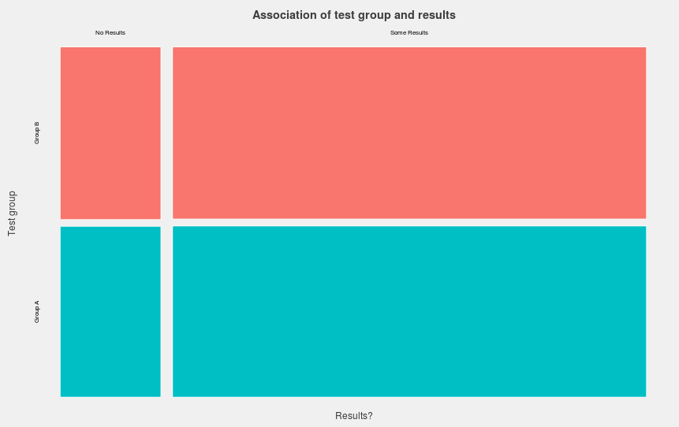

This report covers the first A/B test run by the Discovery team. In summary, we did not find an unambiguous improvement in outcome for users subject to the experimental condition, and recommend disabling the experiment and returning users to the default search experience - coupled with some pointers on future A/B test design.

## Background and Methods

On Thursday, 6 August 2015 we launched an A/B test over the Wikimedia search system ("Cirrus") aimed at reducing the rate at which user queries would provide no results.

This test ran for 1 week over 10% of user queries. 50% of those users were given our default search experience, and the remaining 50% were given a system that had a reduced confidence - in other words, produced results when it was less certain they were *good* results - and a different smoothing algorithm to try and increase the quality of results returned with that reduced confidence.

Our intent with this test was not only to impact the zero results rate but to identify problems with the testing process and resolve them so that future, larger tests would have more reliable outcomes (and those outcomes would be easier to reach).

## Results

### Initial

The initial analysis we performed (which is documented separately) ran over 7 million events from the first day of A/B testing. It found statistically significant difference, with the test group showing a lower zero results rate than the control group, but this difference was small enough to be caused by sampling issues (discussed below), or to be entirely real but not worth deploying more widely.

### Final

For the final analysis we examined 7 days of logs, removing entries that only contained prefix search queries (which were not impacted by the test) or which came from known misusers of our systems. This resulted in a dataset of 13,450,869 events between 7 and 14 August 2015.



```{r, include = FALSE, eval = FALSE}
x <- matrix(c(1183934, 1170787, 5563138, 5533010), nrow = 2)
colnames(x) <- c("no results", "some results")
rownames(x) <- c("b", "a")
sqrt(chisq.test(x)$statistic/sum(x)) # effect size - Cohen's w
```

As with the initial test, there is no visual distinction between the outcome for Group A (the control group) or Group B (the test group). We performed a $\chi^2$ test of independence and found evidence indicating significant association between group membership and outcome (*p* < 0.001), but a very small effect size -- Cohen's $w = 0.001$ (0.1 is considered small).

What that association favours, however, is not Group B, as seen in the initial analysis - it's Group A. People given the default treatment are statistically significantly more likely to get results than those subject to the experimental treatment, albeit not enough to make much of a difference (the improvement is 0.08%)

## Conclusion

Based on the tiny effect size seen and the flip of the direction of this effect between the initial and final sample, we argue that the experiment failed to demonstrate an improvement in the zero results rate for searches in the testing group. We recommend that the experiment be switched off, and that all users should recieve the existing, 'default' search experience.

## Discussion

So, the final analysis has produced the opposite outcome to the initial analysis. What does this mean? The most probable reason for this is the size of the datasets. When dealing with 7m and 13m events, respectively, over two conditions, we have enough power to detect very small effects, ones that vary wildly depending on *which* large sample is being used - where nothing is really taking place. It's simply the natural variation in the datasets on a large enough scale that significance is possible to achieve.

One solution for this problem is to perform power analyses before experiments to identify the number of results needed to see the smallest improvement we would be comfortable with, and using this to inform our sampling rate. That way we can be more certain that the effect we see (e.g. 0.1% improvement) is statistically significant not just because our dataset is large enough to detect the smallest of effects. We can also (instead of, or in addition to, power analysis) switch to a more Bayesian approach to A/B testing that is not as vulnerable to this class of issue.

In terms of how we approach future experiments, the conclusions of the initial analysis around experimental design stand, but are augmented with a recommendation that power analysis be performed prior to the setting of a sample rate, for each A/B test or other type of experiment we deploy.

We want to note that the team did not deploy a change based on intuition. The team had a hypothesis that a software change would improve search results, tested it, and saw it did not have the impact we thought it might have. We are pleased that the team as a whole is moving towards a scientific, data-driven approach to decision making.
