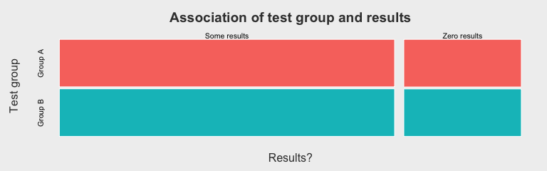

# Suggestion Confidence A/B Test Initial Analysis
Mikhail Popov  
August 11, 2015  

## Packages Used In Analysis


```r
# install.packages('ggthemes', dependencies = TRUE) # for theme_fivethirtyeight
# install.packages('import') # for importing specific functions from packages
# install.packages(
#   'printr',
#   type = 'source',
#   repos = c('http://yihui.name/xran', 'http://cran.rstudio.com')
# )
c("magrittr", "tidyr", "knitr", "ggplot2", "ggthemes", "printr") %>%
  sapply(library, character.only = TRUE) %>% invisible
import::from(dplyr, select, arrange, rename, mutate, summarise, keep_where = filter)
```


```r
load("ab_test_initial_data_exclude-abuser.RData")
```

## Data Cleanup

Oliver has taken care of parsing the log files from JSON-y format to a tabular one. He has also mapped IP addresses to country codes and parsed the user agents and tagged known automata. He also noticed that a specific IP address from Germany is an abusive spider responsible for 2.1 million of the observations. We are excluding this "user" from analysis.

## Summary Statistics


```r
with(data, {
  table(test_group, results) %>% prop.table(margin = 1)
}) %>% kable
```

      Some results   Zero results
---  -------------  -------------
a        0.7399656      0.2600344
b        0.7409764      0.2590236

## Significance Testing


```r
mosaicplot(results ~ test_group, data = data, shade = TRUE,
           main = "Association of test group and results",
           xlab = "Got results", ylab = "Test group")
```

 

```r
# We can see from this mosaic plot that there might be an association.
```


```r
par(mfrow = c(1, 2))
mosaicplot(zero_results ~ test_group, data = keep_where(data, class != "Spider"),
           shade = TRUE, sub = "(Actual users)",
           main = "Association of test group and zero results",
           xlab = "Got zero results", ylab = "Test group")
mosaicplot(zero_results ~ test_group, data = keep_where(data, class == "Spider"),
           shade = TRUE, sub = "(Known spiders)",
           main = "Association of test group and zero results",
           xlab = "Got zero results", ylab = "Test group")
```

 

**Hypothesis**: Group (A/B) and Results (Y/N) are independent.

With a large sample...

When we look at the standardized residuals (also shown in the mosaic plot above), we see that slightly more users form Group B would have gotten results than if the variables were truly independent.


      Some results   Zero results
---  -------------  -------------
a        -2.684949       2.684949
b         2.684949      -2.684949


```r
# install.packages('Exact') # for exact.test
# install.packages('Barnard') # for barnardw.test
```
