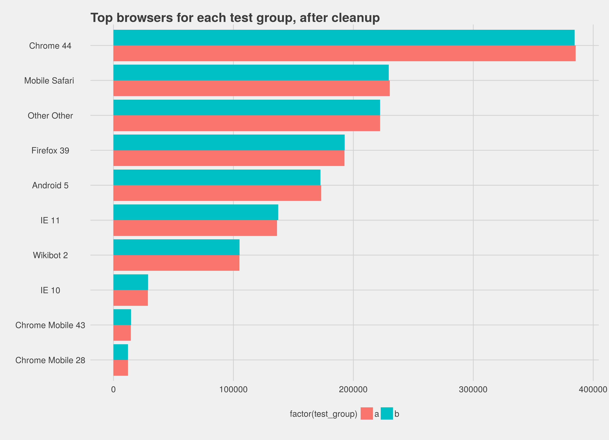
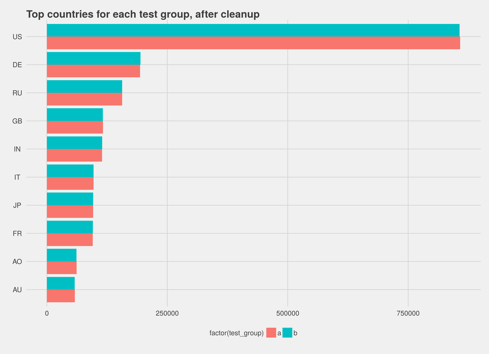
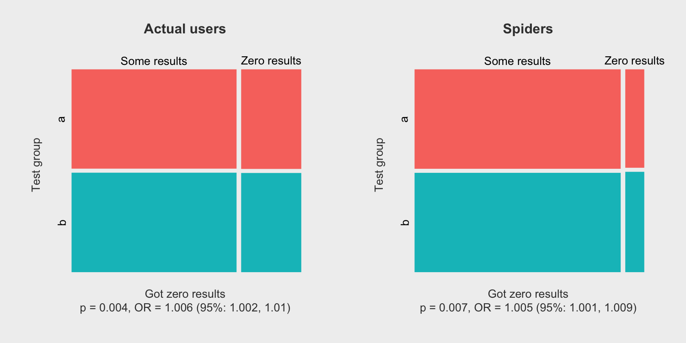

## The Test

* We wanted to reduce the rate of zero results.
* One way of doing this is to reduce the required "certainty" in a suggestion before Cirrus provides it to the user.
* Lower certainty == more results given!
* At the same time, we changed the smoothing algorithm to avoid giving *bad* results.

## The methodology

* 10% of the search sessions
* Half got the default ("control"); half got different smoothing algorithm + reduced certainty ("treatment").
* Due to difficulty of handling the data format, only an initial sample; 7m events from 7 August.

## Testing sampling

* Check that sampling works!
* On the face of it, it appears to; 0.01% variation in events between groups.

## Browsers


## Geography


## Analysis

* So, sampling works - what next?
* Analyse the actual data, looking for a statistically significant variation in whether any results were returned (TRUE) versus
none whatsoever (FALSE)
* Over to Mikhail!

## Exploratory data analysis

```{r, fig.height = 3, fig.width = 8, echo = FALSE}
x <- matrix(c(2006695, 2009528, 705181, 702472), nrow = 2, byrow = FALSE)
rownames(x) <- c("Group A", "Group B")
colnames(x) <- c("Some results","Zero results")
par(mar = c(2, 2, 2, 0)) # c(5, 4, 4, 2) + 0.1 # c(bottom, left, top, right)
mosaicplot(t(x), color = c("cornflowerblue", "orange"), border = "white",
           main = "Association of test group and results",
           xlab = "Results?", ylab = "Test group", margin = NULL)
```

What we want to see is the "some results" quadrant a lot wider in B than it is in A. However, it seems as if they're almost exactly the same in size.

**Hypothesis**: Group (A vs B) and Results (Some vs Zero) are independent (not related).

Using this initial set of data, we can reject the hypothesis (p = 0.0073). The odds of getting results for those in group B (orange) was 1.005 times the odds for those in group A (blue) -- 95% CI: (1.0014, 1.0091).

## Breakdown by class

**Overall**, Group B (orange) is associated with better results, BUT only ever so slightly. Let's break it by class:



## Actual users in US (for example)

As Oliver showed earlier, the largest geographical group in the dataset are the users from US (~32%). So what were actual (non-spider) users experiencing at that point in time?

```{r, echo = FALSE, eval = FALSE}
x <- matrix(c(570260, 569517, 177328, 176973), nrow = 2, byrow = FALSE); colnames(x) <- c('Some results', 'Zero results'); rownames(x) <- c('a', 'b')
x %>% prop.table(margin = 1) %>% apply(1:2, function(xx) {
  sprintf("%.2f%%", 100 * xx)
}) %>% knitr::kable()
```

|   |Some results          |Zero results          |
|:--|:---------------------|:---------------------|
|a  |570260 (76.28%)       |177328 (23.72%)       |
|b  |569517 (76.29%)       |176973 (23.71%)       |

<br>
Nearly the same percentages of queries from US got results (76.28% in A vs 76.29% in B). Significance testing showed the two are not associated (p = 0.86).

## Retrospective

### What worked
* All the key infrastructure for Inf future A/B tests is built, remarkably fast
* We're getting into the workflow of how to analyse the data that comes in.

### What didn't work
* The data format needs a ton of tweaks. Mikhail has taken the lead on drafting a proposal for a new format, which LGTM.
* Setting things up as a proper scientific experiment (Theory - Hypothesis - Experiment - Result) wasn't done. In future we
need to include the Swifties in conversations about what we're doing + how + why if we want the results to be useful.
* Due to (2) we haven't advanced our knowledge around search, which is a big benefit of running these tests.

## Conclusions
* The system works;
* [did the change work]
* Things are promising, but we have some work to do before the next test.
